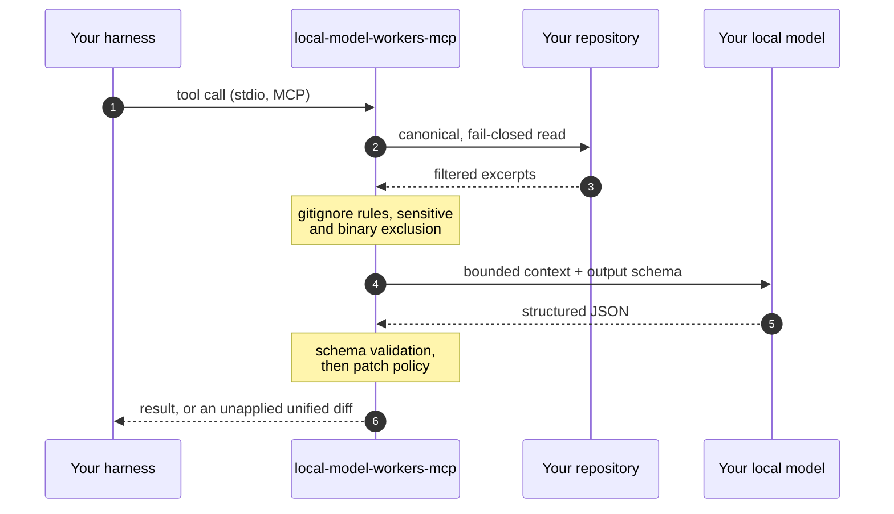

<div align="center">


[](https://github.com/gaabrielrd/local-model-workers-mcp/actions/workflows/validate.yml)
[](https://www.npmjs.com/package/local-model-workers-mcp)
[](https://www.npmjs.com/package/local-model-workers-mcp)
[](LICENSE)
[](package.json)

**[Quick start](#quick-start) · [How it works](#how-it-works) · [Tools](#the-15-tools) · [Security](#why-this-is-safe) · [Docs](#documentation)**

</div>

---

Local Model Workers MCP is a local MCP server that lets your AI coding tools
delegate the expensive parts of repository work — exploration, semantic search,
code queries, test generation, docs, and lint or type fixes — to a model you
run yourself on **LM Studio, Ollama, vLLM, or LocalAI**.

It returns **validated, unapplied diffs** and structured results. The server,
not the model, is the security boundary: it reads your repository, filters what
leaves, validates what comes back, and never writes to your project.

## Quick start

```sh
npx local-model-workers-mcp setup
```

<div align="center">

</div>

The guided setup detects your served models, lets you pick feature groups and
target harnesses (arrow keys to move, `Space` to toggle, `Enter` to confirm),
writes the harness configuration, installs a managed steering block so your
agent knows these tools exist, and finishes with a live health check.

Prefer a global install:

```sh
npm install --global local-model-workers-mcp
```

Non-interactive, for scripts and CI:

```sh
local-model-workers-mcp setup --target all --features exploration,tests,docs,lint --url "http://localhost:1234/v1" --yes
```

Then just start your agent — setup already registered the server:

| Harness | Registered in |
| --- | --- |
| Claude Code | `.mcp.json` (project) or `~/.claude.json` (global) |
| Codex | `~/.codex/config.toml` |
| Cursor | `.cursor/mcp.json` or `~/.cursor/mcp.json` |
| VS Code · Roo Code · Cline | `.vscode/mcp.json` or `~/.vscode/mcp.json` |
| Neovim · Avante | `~/.config/nvim/mcp.json` |
| JetBrains IDEs | shared AI Assistant `mcp.json` |
| Antigravity | `~/.gemini/config/mcp_config.json` |

## How it works

<div align="center">

</div>

Every tool call follows the same path, and the model never touches your disk:



1. **Reads** the repository through a canonical, fail-closed read capability —
   path sandbox, Git ignore rules, sensitive and binary exclusions.
2. **Sends only bounded context** to your model over the trusted LAN.
3. **Validates** the structured response against a strict schema.
4. **Returns** structured results — and writes as unapplied unified diffs.

The model can never write to your repository, apply a patch, or run a project
command. Generated tests execute only inside an isolated temporary copy.

## The 15 tools

Tools are grouped, and you choose which groups to register during setup.
`check_health`, `get_config`, `get_offload_stats`, `validate_config`, and
`update_config` are always available.

| Group | Tools | What you get |
| --- | --- | --- |
| **Exploration** | `explore_repository` · `query_code_graph` · `search_semantic` · `summarize_module` | Goal-directed analysis, symbol/caller/dependency queries, and a persistent SQLite vector index |
| **Tests** | `propose_tests` · `auto_validate_tests` | Test-only diffs, optionally iterated in a sandbox until they actually pass |
| **Docs** | `generate_docs_patch` · `analyze_diff` | Docs-only patches and semantic commit-range analysis |
| **Lint** | `fix_lint_violations` · `fix_type_errors` | Narrow diffs for ESLint, Biome, Ruff, `tsc`, `mypy`, and `pyright` output |
| **Administration** | `check_health` · `get_config` · `get_offload_stats` · `validate_config` · `update_config` | Per-provider health, redacted config, and measurable token savings |

Symbols are recognized in TypeScript, JavaScript, Python, Go, Rust, Java, C#,
Kotlin, Swift, Scala, PHP, Ruby, and Elixir.

## Why this is safe

- **Your code stays on your network.** Only filtered, bounded excerpts reach a
  model you control, on your machine or a trusted private LAN.
- **The server never writes to your project.** Every write-shaped result is an
  unapplied unified diff that you review and apply yourself.
- **Repository text is fenced.** Every excerpt sent to a model is wrapped in a
  nonce-delimited untrusted-data block, with your task instructions kept outside
  it, so text committed to a file cannot hijack the request.
- **Patches are structurally validated.** Test proposals must be test-only,
  docs patches docs-only, and every patch respects file and changed-line
  ceilings before you ever see it.
- **Secrets are redacted everywhere.** Bearer tokens never appear in
  configuration output, health responses, logs, stdout, stderr, or setup
  summaries — and every tool result is scrubbed at the MCP boundary, so a
  credential a model echoes back never reaches your transcript.
- **Test execution is isolated.** Generated tests run in a throwaway copy of
  the repository, never your working tree.

Full threat model: [docs/security.md](docs/security.md).

## Configuration

Minimal environment:

```sh
export LMW_LM_STUDIO_BASE_URL='http://localhost:1234/v1'
export LMW_ALLOWED_MODELS='["qwen/qwen3.5-9b"]'   # optional: defaults to all served models
```

For multi-provider routing, set `LMW_PROVIDERS` to a protected JSON array — the
router picks the first healthy provider that serves the requested model, with
priority routing, health checks, circuit breakers, and failover across LM
Studio, Ollama, vLLM, and LocalAI. See
[docs/configuration.md](docs/configuration.md) for the full contract.

The CLI honors [`NO_COLOR`](https://no-color.org) and `FORCE_COLOR`, and falls
back to plain ASCII on non-TTY, non-UTF-8, and legacy Windows consoles.

## Quality

- Published on [npm](https://www.npmjs.com/package/local-model-workers-mcp) and
  attached to the latest
  [GitHub Release](https://github.com/gaabrielrd/local-model-workers-mcp/releases/latest)
  under the MIT license.
- `npm run validate` is green on macOS, Linux, and Windows CI — formatting,
  lint, feature boundaries, typecheck, build, and 553 automated tests.
- Release qualification verifies the packaged server registers all 15 tools and
  runs real-model structured-output probes.

## Documentation

- [Architecture](docs/architecture.md) · [Security model](docs/security.md) ·
  [Configuration](docs/configuration.md) · [Installation & harness setup](docs/installation.md)
- [MCP tool reference](docs/mcp-tools.md) · [Testing strategy](docs/testing.md) ·
  [External integrations](docs/integrations.md) · [Architecture decisions](docs/decisions/README.md)
- [Product requirements](prd.md) · [Development process](docs/development-process.md) ·
  [Roadmap](docs/roadmap.md)

## Development

Requires Node.js 24.18.x and npm 11.x (see `.nvmrc`):

```sh
nvm use
npm ci
npm run validate
```

`npm run validate` checks formatting, linting, feature boundaries, types,
tests, and the production build. Build and inspect a release candidate with:

```sh
npm run build
npm run pack:check
npm run release:smoke
```

## License

[MIT](LICENSE)
